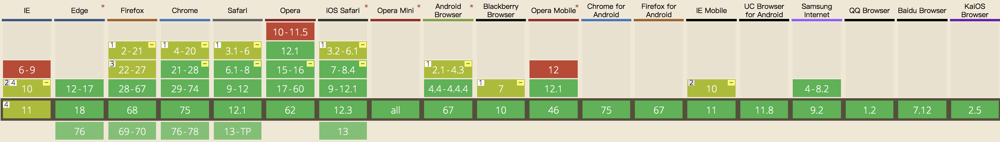

# TARO FlexBox 测试项目

> [Taro 跨端样式方案](https://github.com/NervJS/taro-flexbox/wiki)

[web]: asset/ScreenShot_Web.jpeg
[weapp]: asset/ScreenShot_WeChat.png
[swan]: asset/ScreenShot_Baidu.png
[alipay]: asset/ScreenShot_Alipay.png
[tt]: asset/ScreenShot_ByteDance.jpeg
[qq]: asset/ScreenShot_QQ.png
[ios]: asset/ScreenShot_iOS.png
[android]: asset/ScreenShot_Android.png

## 关于 Flex 布局

2009年，**W3C** 提出了一种新的方案--Flex 布局，可以简便、完整、响应式地实现各种页面布局，且在除了 IE 之外的浏览器上都表现良好。

[](https://caniuse.com/#feat=flexbox)

> Flex 是 Flexible Box 的缩写，意为"弹性布局"，用来为盒状模型提供最大的灵活性。
> 
> 任何一个容器都可以指定为 Flex 布局。

```css
.flex-container {
  display: -webkit-flex; /* Safari */
  display: flex;
}
```

行内元素也可以使用 Flex 布局。

```css
.flex-container {
  display: -webkit-inline-flex; /* Safari */
  display: inline-flex;
}
```

## 安装并编译项目

```sh
// 克隆项目
git clone https://github.com/ZakaryCode/taro-flexbox.git

// 进入项目目录
cd taro-flexbox/flexbox-demo

// 安装依赖
yarn install

// 编译项目
yarn build
```

## 适配平台

- [x] 微信小程序 weapp
- [x] 智能小程序 swan
- [x] 阿里小程序 alipay
- [x] 头条小程序 tt
- [x] h5
- [x] rn
- [x] QQ轻应用 qq
- [ ] 快应用 quickapp

## 预览效果

| weapp | swan | alipay | qq |
|:--:|:--:|:--:|:--:|
|![weapp]|![swan]|![alipay]|![qq]

| Web | tt | iOS | Android |
|:--:|:--:|:--:|:--:|
|![web]|![tt]|![ios]|![android]|
